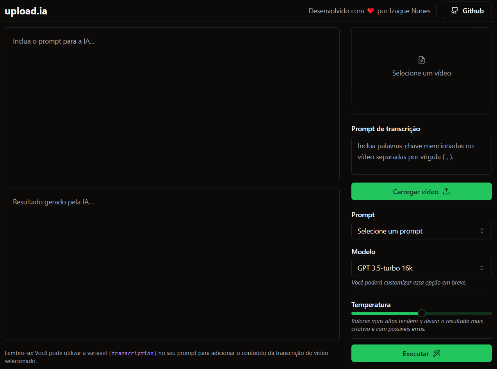
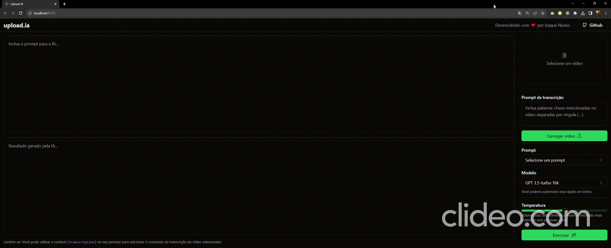

### 👨‍💻 Telas
## 

### Interface


### ℹ Sobre
##
Projeto de uma interface que transcreve tópicos e resumos a partir de um vídeo. 
### ⛏ Ferramentas
##

- [React](https://react.dev/learn)

- [Prisma ORM](https://www.prisma.io/docs)

- [Typescript](https://www.typescriptlang.org/)

- [Fastify](https://github.com/fastify/fastify-multipart)

- [Shadcn/ui](https://ui.shadcn.com/)

- [Tailwind CSS](https://tailwindcss.com/docs/installation)

- [Vite](https://vitejs.dev/guide/)
 
### 🟩 Uso
##


### 👩‍💻 Como contribuir
#### 1. Clone o repositório do projeto
```
$ git clone https://github.com/IzaqueNunes/video-transcription-with-ai.git
```
#### 2. Acesse as pastas
```
$ cd upload-ia-api
$ cd upload-ia-web
```
#### 3. Instale as dependencias em cada pasta
```
$ pnpm i
```
#### 4. Acesse cada pasta (api e web) e execute o seguinte comando para inicilizar o front e back end da aplicação
```
$ pnpm run dev
```
